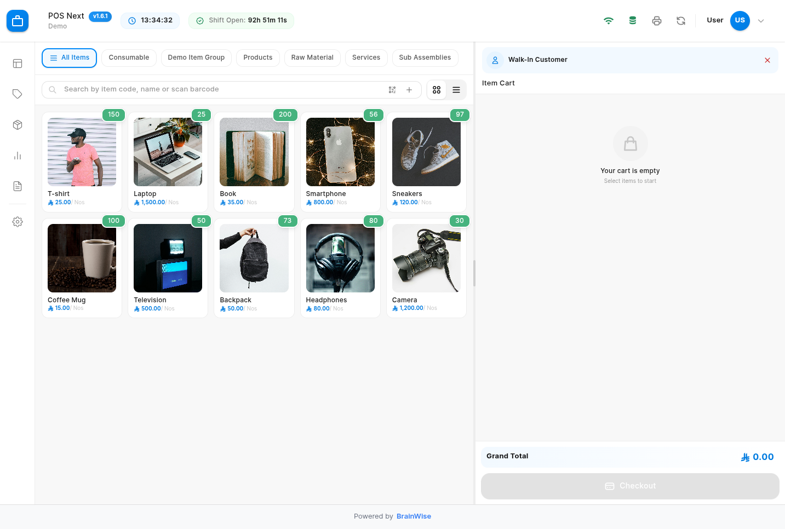
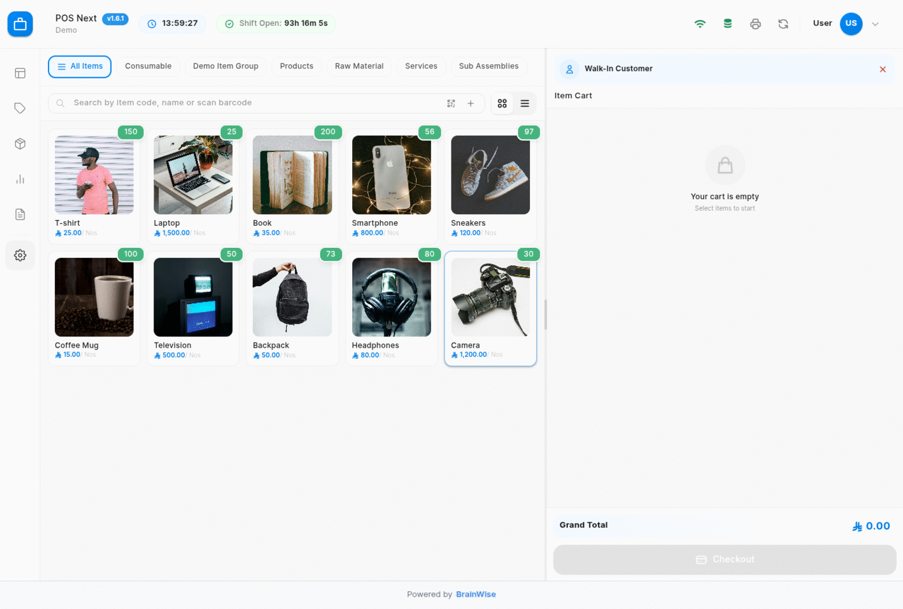
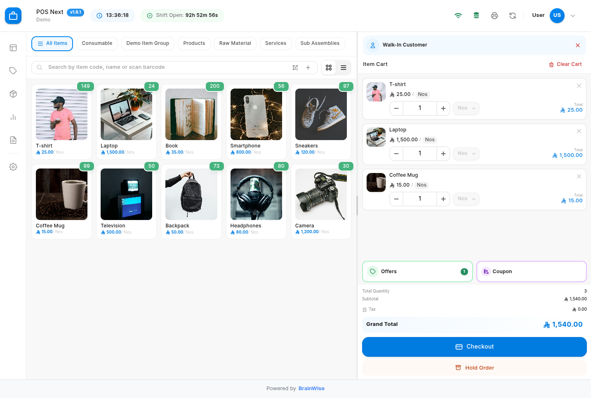
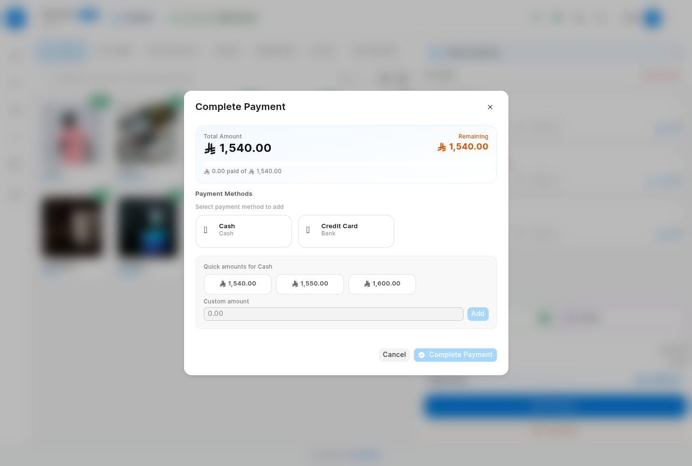
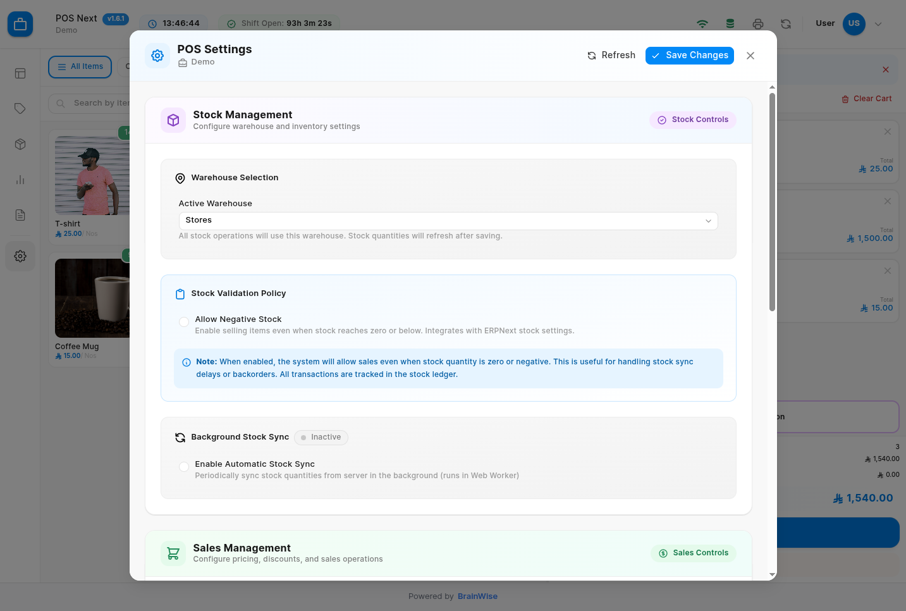

# POS Next

<div align="center">



**A modern, lightning-fast Point of Sale system for ERPNext**

[](LICENSE)
[](https://github.com/frappe/frappe)
[](https://github.com/frappe/erpnext)

[Features](#-features) • [Installation](#-installation) • [Quick Start](#-quick-start) • [Demo](#-demo) • [Documentation](#-documentation)

</div>

---

## 🎯 Why POS Next?

POS Next is a **complete rewrite** of the ERPNext POS system, built from the ground up with modern technologies to deliver:

- ⚡ **Blazing Fast Performance** - Vue 3 + Vite for instant load times
- 🔄 **True Offline Support** - Keep selling even when your internet drops
- 💎 **Modern UI/UX** - Clean, intuitive interface your staff will love
- 🎁 **Advanced Promotions** - Full-featured offers, coupons, and gift cards
- 💰 **Smart Payments** - Multiple payment methods, partial payments, split bills
- 📊 **Real-time Insights** - Live shift tracking and instant reports

## 📸 See It In Action

### Complete Sales Cycle



## 📞 Support & Community

- 🐛 **Bug Reports**: [GitHub Issues](https://github.com/BrainWise-DEV/pos_next/issues)
- 💬 **Discussions**: [GitHub Discussions](https://github.com/BrainWise-DEV/pos_next/discussions)
- 📖 **Forum**: [Frappe Community](https://discuss.frappe.io/)
- 📱 **Telegram Group**: [Join our community](https://t.me/+J2WHnNKCn8ZhOWQ0) - Get help, share ideas, and connect with other users
- 📧 **Email**: support@brainwise.me

### Key Features

<table>
  <tr>
    <td width="50%">
      
      <p align="center"><b>Intuitive Shopping Cart</b><br/>Add items instantly with barcode scanning or search</p>
    </td>
    <td width="50%">
      
      <p align="center"><b>Smart Payment Processing</b><br/>Multiple payment methods, quick amounts, partial payments</p>
    </td>
  </tr>
  <tr>
    <td width="50%">
      
      <p align="center"><b>Promotional Schemes</b><br/>Buy X Get Y, discounts, bundle offers, and more</p>
    </td>
    <td width="50%">
      
      <p align="center"><b>Comprehensive Settings</b><br/>Flexible configuration for every business need</p>
    </td>
  </tr>
</table>

## ✨ Features

### Core Functionality

- 🚀 **Modern Tech Stack**
  - Vue 3 with Composition API
  - Vite for lightning-fast builds
  - Tailwind CSS for beautiful UI
  - TypeScript-ready architecture

- 🔄 **Offline-First Architecture**
  - IndexedDB for local data caching
  - Background sync when online
  - Web Workers for smooth performance
  - Service Worker for true PWA support

- 💰 **Advanced Payment Options**
  - Multiple payment methods per transaction
  - Partial payments with tracking
  - Quick amount buttons for faster checkout
  - Change calculation and write-off
  - Credit sale support with approval

- 🎁 **Promotional Engine**
  - **Coupons**: Percentage, fixed amount, free items
  - **Promotional Schemes**: Buy X Get Y, tiered discounts
  - **Gift Cards**: Full gift card management
  - Auto-apply eligible offers
  - Stack multiple promotions

- 💱 **Multi-Currency Support**
  - Proper currency symbols (E£, ر.س, د.إ, $, €, £)
  - Real-time exchange rates
  - Currency-specific formatting

- 💾 **Draft Invoices (Hold Orders)**
  - Save incomplete transactions
  - Resume from any device
  - Automatic cleanup
  - Badge count indicator

- 🔄 **Returns Management**
  - Quick return invoice processing
  - Partial or full returns
  - Auto-credit note generation
  - Stock adjustment

- 💼 **Shift Management**
  - Open/close shift workflow
  - Live shift timer in navbar
  - Shift-wise sales reports
  - Cash reconciliation

- 🔍 **Smart Search**
  - Real-time item search
  - Barcode scanning support
  - Item group filtering
  - Keyboard shortcuts (F4, F8, F9)

- 📱 **Responsive Design**
  - Desktop optimized
  - Tablet friendly
  - Touch-screen ready
  - Grid and list views

### Technical Features

- 🔥 **Performance Optimized**
  - Virtual scrolling for large inventories
  - Lazy loading components
  - Debounced search
  - Optimistic UI updates

- 🔒 **Enterprise Ready**
  - Role-based permissions
  - Audit trail logging
  - Multi-warehouse support
  - Tax compliance ready

- 🌐 **Internationalization**
  - RTL support ready
  - Multi-language capable
  - Regional formats

## 📋 Prerequisites

- **Frappe Framework** version 15 or higher
- **ERPNext** version 15 or higher
- Modern browser (Chrome, Firefox, Safari, Edge)

## 🚀 Installation

### Fresh Installation

```bash
# Navigate to your bench
cd ~/frappe-bench

# Get the app from GitHub
bench get-app https://github.com/BrainWise-DEV/pos_next.git --branch develop

# Install on your site
bench --site [your-site-name] install-app pos_next

# Run migrations
bench --site [your-site-name] migrate

# Build assets
bench build --app pos_next

# Restart (production only)
bench restart
```

### Development Setup

```bash
# Get app in dev mode
cd ~/frappe-bench
bench get-app /path/to/pos_next

# Install frontend dependencies
cd apps/pos_next/POS
npm install

# Run dev server with hot reload
npm run dev

# In another terminal, start Frappe
bench start
```

## 🔄 Updating

Already have POS Next? Update to the latest version:

```bash
cd ~/frappe-bench/apps/pos_next
git pull origin develop
cd ../..

# Apply updates
bench --site [your-site-name] migrate
bench build --app pos_next
bench --site [your-site-name] clear-cache

# Restart (production only - skip if using bench start)
bench restart
```

## 🎯 Quick Start

### 1. Setup POS Profile

Navigate to: **Retail > POS Profile > New**

Configure:
- Company and Warehouse
- Price List and Currency
- Payment Methods (Cash, Card, etc.)
- Default Customer (Walk-In)

### 2. Access POS

Visit: `https://your-site.com/pos` or `http://localhost:8000/pos`

### 3. Make Your First Sale

1. **Search Items** - Press `F4` or scan barcode
2. **Add to Cart** - Click items or use auto-add mode
3. **Select Customer** - Press `F8` (optional)
4. **Apply Offers** - Green button shows available offers
5. **Checkout** - Press `F9`, select payment method
6. **Print** - Receipt prints automatically

### Optional: Create Promotional Offers

**POS Offer**: `POS Next > POS Offer > New`
**POS Coupon**: `POS Next > POS Coupon > New`

## ⌨️ Keyboard Shortcuts

| Shortcut | Action |
|----------|--------|
| `F4` | Search items |
| `F8` | Search customers |
| `F9` | Proceed to checkout |
| `Ctrl+S` | Save draft (hold order) |
| `Esc` | Close dialog |

## 🎨 Feature Highlights

### Offline Mode

Never lose a sale! POS Next works seamlessly even without internet:
- All item data cached locally
- Stock levels synced in background
- Invoices saved and uploaded when online
- Visual indicator shows connection status

### Smart Offers Engine

Maximize revenue with sophisticated promotions:
- **Buy 2 Get 1 Free** - Product-based offers
- **Spend $100, Get 10% Off** - Value-based discounts
- **Seasonal Coupons** - Time-limited promotions
- **Free Shipping** - Threshold-based benefits

### Shift Management

Complete shift lifecycle:
- Open shift to start selling
- Live timer shows shift duration
- Close shift for reconciliation
- Detailed shift reports with cash movements

## 💱 Currency Support

Display prices in proper local format:
- **Egypt**: E£ (EGP)
- **Saudi Arabia**: ر.س (SAR)
- **UAE**: د.إ (AED)
- **US**: $ (USD)
- **Europe**: € (EUR)
- **UK**: £ (GBP)
- And many more...

## 🔧 Configuration

### Stock Settings

- **Warehouse Selection**: Choose active warehouse
- **Negative Stock**: Allow overselling
- **Auto Sync**: Background stock updates
- **Stock Policy**: Validation rules

### Pricing & Discounts

- **Tax Inclusive**: Prices include tax
- **Max Discount**: Item-level limits
- **Additional Discount**: Invoice-level
- **Rounded Totals**: Exact or rounded

### Sales Operations

- **Credit Sales**: Allow payment terms
- **Partial Payments**: Split over multiple methods
- **Returns**: Enable return processing
- **Write-off**: Small change amounts
- **Silent Print**: Auto-print receipts

## 🛠️ Troubleshooting

### Items Not Loading

**Check:**
1. Items exist in selected warehouse
2. Price list has item prices defined
3. POS Profile warehouse setting
4. Browser console for errors

**Solution:** Clear cache and reload
```bash
bench --site [your-site-name] clear-cache
```

### Offline Mode Not Working

**Check:**
1. Service Worker registered
2. IndexedDB enabled in browser
3. Sufficient storage available

**Solution:** Check browser console, ensure HTTPS (required for Service Workers)

### Close Shift Not Working

**Status:** Fixed in v1.6.0+

**Solution:** Update to latest version

## 🏗️ Build for Production

```bash
cd apps/pos_next/POS
npm run build
bench build --app pos_next
bench restart
```

## 🔌 API Reference

### Get Available Offers

```python
frappe.call({
    method: 'pos_next.api.offers.get_offers',
    args: {
        pos_profile: 'Main POS',
        customer: 'CUST-00001'
    },
    callback: (r) => console.log(r.message)
})
```

### Validate Coupon

```python
frappe.call({
    method: 'pos_next.api.offers.validate_coupon',
    args: {
        coupon_code: 'SUMMER2024',
        customer: 'CUST-00001',
        company: 'My Company',
        grand_total: 1000
    },
    callback: (r) => console.log(r.message)
})
```

### Create Invoice

```python
frappe.call({
    method: 'pos_next.api.invoices.create_invoice',
    args: {
        invoice_data: {
            customer: 'CUST-00001',
            items: [
                { item_code: 'ITEM-001', qty: 2, rate: 100 }
            ],
            payments: [
                { mode_of_payment: 'Cash', amount: 200 }
            ]
        }
    },
    callback: (r) => console.log(r.message)
})
```

## 🤝 Contributing

We welcome contributions! Here's how:

1. **Fork** the repository
2. **Create** a feature branch: `git checkout -b feature/amazing-feature`
3. **Install** pre-commit hooks: `cd apps/pos_next && pre-commit install`
4. **Make** your changes
5. **Test** thoroughly
6. **Commit** with clear messages
7. **Push** to your fork
8. **Open** a Pull Request

### Code Quality

We use automated tools to maintain code quality:
- **Python**: ruff, pyupgrade
- **JavaScript**: eslint, prettier
- **Git**: pre-commit hooks

## 📄 License

AGPL-3.0 License - See [LICENSE](LICENSE) file for details

This means you can:
- ✅ Use commercially
- ✅ Modify
- ✅ Distribute
- ✅ Use privately

You must:
- 📋 Disclose source
- 📋 Include license
- 📋 State changes
- 📋 Share alike

## 🙏 Credits & Technology

Built with amazing open-source technologies:

- [Frappe Framework](https://frappeframework.com/) - Full-stack web framework
- [ERPNext](https://erpnext.com/) - Open-source ERP
- [Vue.js 3](https://vuejs.org/) - Progressive JavaScript framework
- [Vite](https://vitejs.dev/) - Next-generation frontend tooling
- [Tailwind CSS](https://tailwindcss.com/) - Utility-first CSS framework
- [Heroicons](https://heroicons.com/) - Beautiful hand-crafted SVG icons

## 📝 Changelog

### v1.6.1 (Latest)
- Enhanced partial payments with overdue status tracking
- Major backend refactoring for better maintainability
- Performance improvements

### v1.6.0
- ✨ Implemented free items support for promotional offers
- 🐛 Fixed tax-inclusive calculation preventing tax being treated as discount
- 🔧 Improved promotional scheme handling

### v1.0.0
- 🎉 Initial release
- ✨ Modern Vue 3 interface
- 🔄 Offline-first architecture
- 💰 Multi-currency support
- 🎁 Coupon and offer system
- 💾 Draft invoice management

## 🎯 Roadmap

Coming soon:

- [ ] 🍽️ **Restaurant Mode** - Table management, kitchen display
- [ ] 📱 **Mobile App** - Native iOS and Android apps
- [ ] 📊 **Advanced Analytics** - Sales insights, trends, forecasting
- [ ] 🎯 **Loyalty Program** - Points, rewards, membership tiers
- [ ] 📦 **Quick Restock** - Low stock alerts, auto-ordering
- [ ] 🖨️ **Receipt Customization** - Custom templates, branding
- [ ] 🔗 **Integration Hub** - Payment gateways, accounting software
- [ ] 👥 **Customer Display** - Facing display for customers

---

<div align="center">

**Made with ❤️ by [BrainWise](https://nexus.brainwise.me)**

⭐ Star us on GitHub — it motivates us a lot!

[Report Bug](https://github.com/BrainWise-DEV/pos_next/issues) • [Request Feature](https://github.com/BrainWise-DEV/pos_next/issues) • [Documentation](https://github.com/BrainWise-DEV/pos_next/wiki)

</div>
